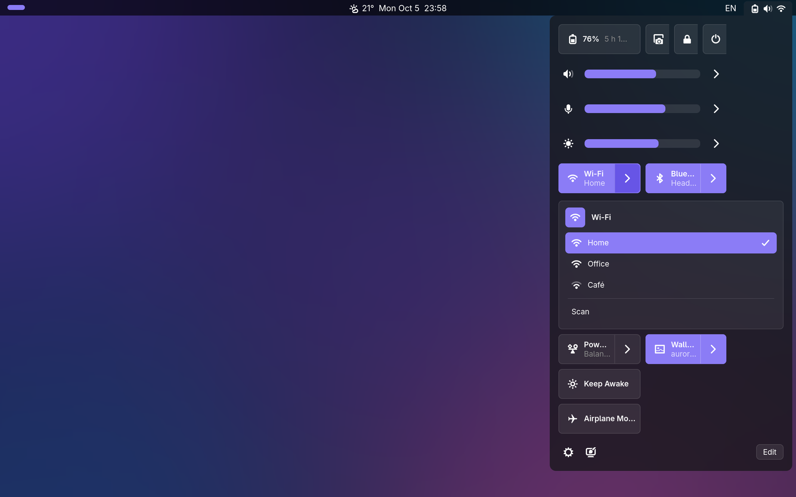
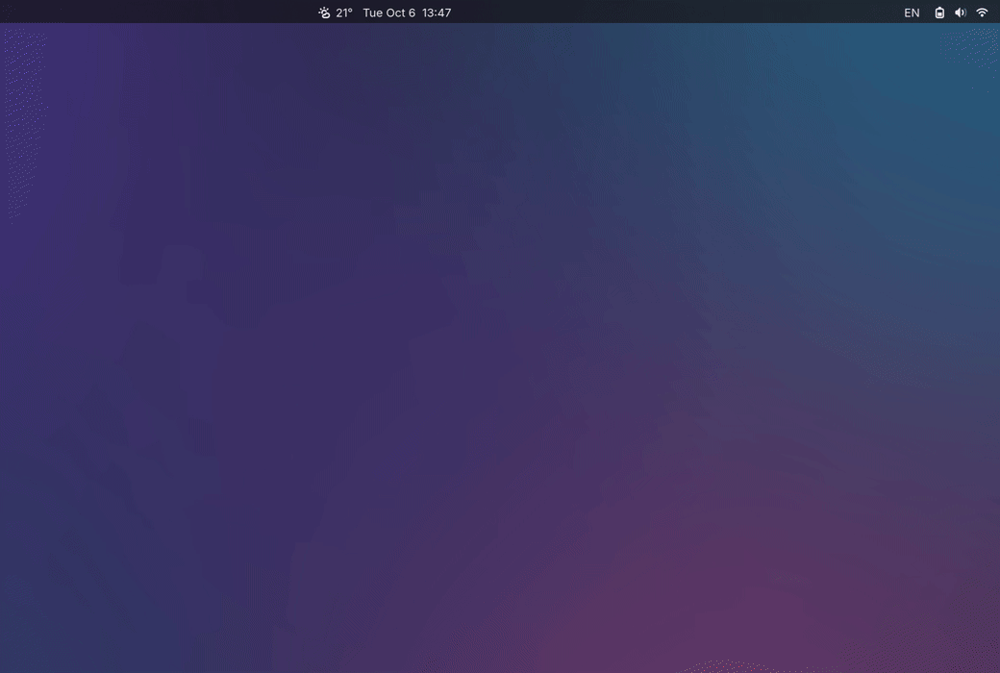
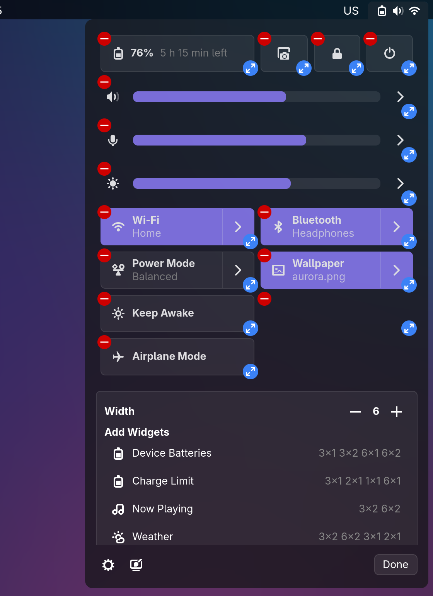
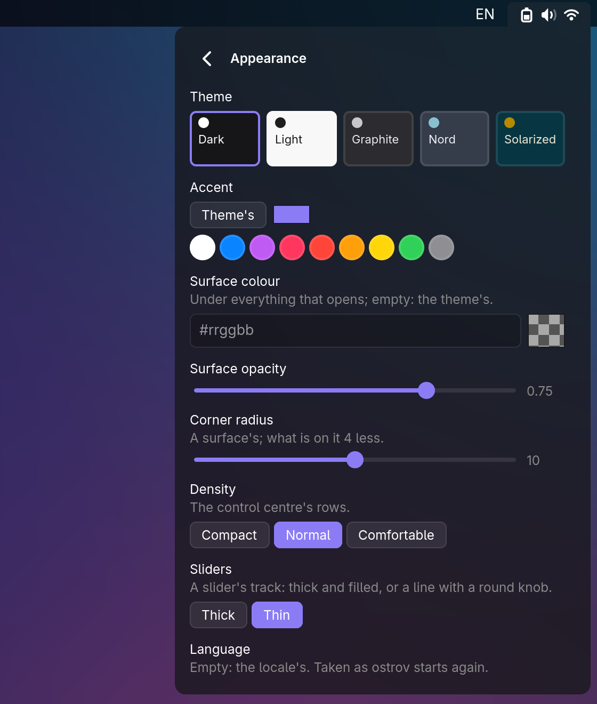
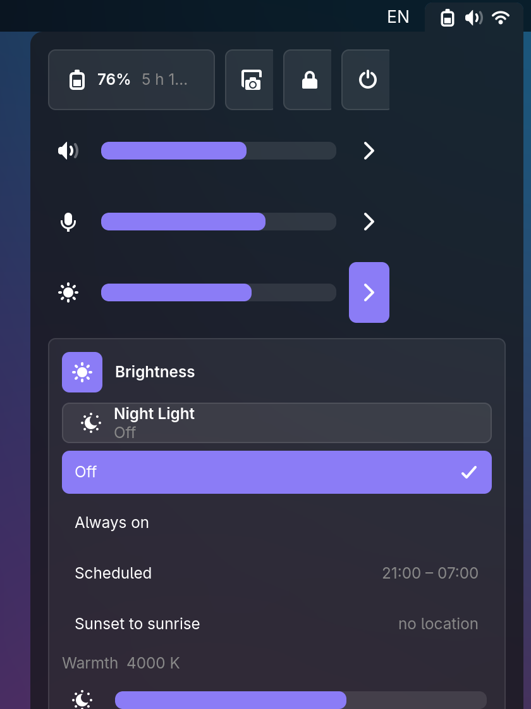

# ostrov

**The desktop [Hyprland](https://hyprland.org) was missing. One install, and it is all there.**

The bar, the control centre, the launcher, notifications, the lock screen, the clipboard, the wallpaper: ostrov
is all of it in one Rust binary, made to look and feel like one thing. No dozen tools to glue together, no
config to write before it works.





## Why ostrov

- **It just works.** Start it and the desktop is there: Wi-Fi, Bluetooth, sound, brightness, battery,
  notifications, a lock screen. A welcome sets the look in a minute. No file to edit.
- **Yours to arrange.** The control centre and the calendar are grids of widgets you drag, resize and add from a
  gallery, like on a Mac. The bar too: drag its blocks where you want them.
- **Beautiful out of the box.** Blur, smooth motion, five themes and any accent colour, all set from its own
  Appearance page.
- **Light.** Native GTK 4 and Rust, one process, no web views.
- **Grows with you.** Widgets in a few lines of KDL, plugins in any language, installed by name from a catalogue:
  screen recording, the night light, CalDAV calendars, removable drives, system updates.

<table>
<tr>
<td></td>
<td></td>
</tr>
<tr>
<td align="center">The calendar, the weather, the player</td>
<td align="center">Arrange it your way</td>
</tr>
<tr>
<td></td>
<td></td>
</tr>
<tr>
<td align="center">Themes and accents</td>
<td align="center">The night light under brightness</td>
</tr>
</table>


## One app instead of nine

| What you would glue together | ostrov |
|---|---|
| waybar | the bar |
| rofi, wofi, fuzzel | the launcher, with a calculator, emoji, files and web search |
| swaync, mako, swayosd | notifications, Do Not Disturb, the volume and brightness OSD |
| nm-applet, blueman, pavucontrol | the control centre: Wi-Fi, Bluetooth, sound per app |
| hyprlock, hypridle | the lock screen and idle |
| cliphist | the clipboard's history, pictures too |
| hyprpaper, swww | the wallpaper |
| grim, slurp | screenshots |
| hyprpolkitagent, ssh-askpass | password questions in one dialog |

One look, one config, one place to change it.

## Install

**1. Get it.** A package from the [latest release](https://github.com/danilrwx/ostrov/releases/latest): `.deb`
for Ubuntu 26.04+ and Debian sid, `.rpm` for Fedora 43+, `.pkg.tar.zst` for Arch, the official plugins in each:

    sudo apt install ./ostrov_*.deb        # or: sudo dnf install ./ostrov-*.rpm, sudo pacman -U ./ostrov-*.pkg.tar.zst
    mkdir -p ~/.local/state/ostrov && touch ~/.local/state/ostrov/hyprland.conf

Or build it (Rust 1.93+, GTK 4, gtk4-layer-shell 1.2+):

    # Arch:   sudo pacman -S rust gtk4 gtk4-layer-shell pam pkgconf
    # Fedora: sudo dnf install cargo gtk4-devel gtk4-layer-shell-devel pam-devel wayland-devel
    # Debian/Ubuntu: sudo apt install cargo libgtk-4-dev libgtk4-layer-shell-dev libpam0g-dev libwayland-dev pkg-config
    cargo install --locked --git https://github.com/danilrwx/ostrov ostrov
    mkdir -p ~/.local/state/ostrov && touch ~/.local/state/ostrov/hyprland.conf

**2. Start it** from `~/.config/hypr/hyprland.conf` (Hyprland 0.53+):

    exec-once = ostrov
    source = ~/.local/state/ostrov/hyprland.conf

**3. Log in again.** That's it: the welcome takes it from there, and `ostrov doctor` says if anything is missing.

Nix, building the packages yourself, and the details: [docs/install.md](docs/install.md).

## Keys

| | |
|---|---|
| **Super+D** | the launcher: apps, calculator, emoji, files, web search |
| **Super+X** | the control centre |
| **Super+C** | the calendar |
| **Super+Shift+V** | the clipboard's history |
| **Print** | a screenshot |
| **Super+Shift+X** | lock |

Bound only where free, never over yours.

## Make it yours

Everything is in the UI: Edit in the control centre, Settings behind its gear, Appearance behind its palette.
And when you want more:

**A widget in a few lines.** Drop a file in `~/.config/ostrov/widgets/`, and it is in the gallery:

```kdl
widget "vpn" name="VPN" icon="network-vpn-symbolic" {
    poll "st" every="5s" exec="myvpn status --json"
    toggle icon="network-vpn-symbolic" title="VPN" sub="{st.profile}" on="{st.on}" {
        click exec="myvpn toggle"
    }
}
```

**Everything from the command line,** for your scripts and binds, tab-completed in zsh, bash and fish:

```sh
ostrov wifi connect HomeNet
ostrov brightness 40
ostrov audio mic-mute
ostrov toast "Build finished" "all tests green"
ostrov plugin night toggle
```

**Plugins in any language.** A program speaking JSON lines; with the Python SDK a toggle is this much:

```python
from ostrov_plugin import Plugin

class Coffee(Plugin):
    on = False

    def render(self, widget):
        return {"type": "toggle", "id": "t", "icon": "face-smile-symbolic", "title": "Coffee", "on": self.on}

    def on_event(self, widget, node, event, value):
        self.on = value == "true"
        self.kick()

Coffee().main()
```

With the SDK's file and a short `manifest.toml` beside it, `ostrov plugin install ./coffee` and it is in the
gallery. The official ones install by name: `ostrov plugin
catalogue`. More: [widgets](docs/widgets.md), [plugins](docs/plugins.md), [themes](docs/themes.md), every
command in [docs/modules.md](docs/modules.md). Something off? [docs/troubleshooting.md](docs/troubleshooting.md).

In English and Русский.

## Contributing

[CONTRIBUTING.md](CONTRIBUTING.md) · [architecture](docs/architecture.md) · [specs](specs/) ·
[changelog](CHANGELOG.md) · MIT licensed
