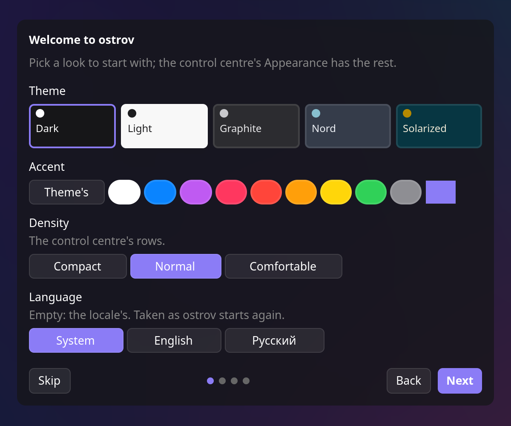
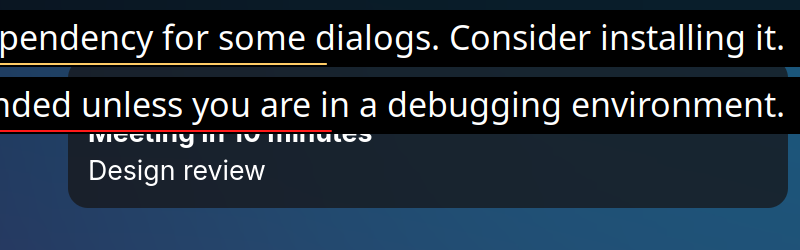
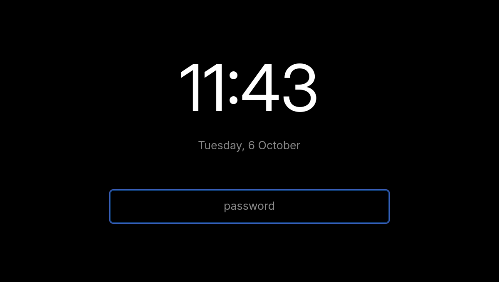

# ostrov

**A whole desktop shell for [Hyprland](https://hyprland.org), in one Rust binary.** ostrov ("island" in
Russian) is the bar, the control centre, the launcher, notifications, the lock screen and the rest of what a
Hyprland desktop is usually pieced together from, made to look and work as one thing.


- **A bar made of blocks**: workspaces, the focused window's title, the tray, the keyboard layout, the privacy
  indicator (mic or camera in use, the screen shared; its menu mutes the mic, turns an app's camera off, stops a
  share), and the faces of the panels, made of their widgets' badges.
- **Panels of widgets**, macOS-style: the control centre and the calendar are grids of widgets (Wi-Fi, Bluetooth,
  volume and mic with per-app sliders, brightness, power modes, battery, Airplane Mode, wallpaper, the player, the weather, the
  month and its events, notifications with Do Not Disturb). Edit them in place, add from a gallery, make your
  own panels.
- **A launcher in the bar**, dmenu-style: apps, a calculator, emoji (`:name`), files (`/name`), web search
  (`s words`, and engines of your own by prefix: `g words`, `?question`), the clipboard's history, and plugins' modes.
- **Notifications** (it is the notification server), with toasts and an OSD for volume and brightness.
- **The lock screen and idle**: ext-session-lock with PAM, locked and screens off after a while and before
  sleep, inhibitors honoured.
- **The polkit agent, SSH's askpass and the screen-share picker**, in ostrov's own dialogs.
- **The clipboard's history** (text and pictures, password managers' entries left out), **screenshots** of a
  region or the screen, **the wallpaper**.
- **Settings and themes in the UI**: a Settings page for every section, an Appearance page with five built-in
  themes and an accent, both writing `config.toml` in place, comments kept.
- **Extensible**: widgets in KDL without code, plugins in any language (a Rust SDK and a Python one), themes,
  a D-Bus interface, shell completion for every command.
- **Official plugins** for the rest: screen recording, the night light, CalDAV calendars, Win+P for displays, removable drives,
  a power profile for games.

<table>
<tr>
<td></td>
<td></td>
</tr>
<tr>
<td align="center">The calendar panel</td>
<td align="center">Edit, with the gallery</td>
</tr>
<tr>
<td></td>
<td></td>
</tr>
<tr>
<td align="center">Appearance, in the light theme</td>
<td align="center">The first run's welcome</td>
</tr>
</table>


<table>
<tr>
<td></td>
<td></td>
</tr>
<tr>
<td align="center">A notification</td>
<td align="center">The lock screen</td>
</tr>
</table>

## Requirements

ostrov is made for **Hyprland 0.53** or newer, and for it alone: under another compositor the bar, panels and the
rest still run, without workspaces, the window's title, the keyboard layout and the panels' focus grab.

Libraries: GTK 4.14 or newer, gtk4-layer-shell 1.2 or newer (it also provides the session lock), GLib 2.80 or
newer, libwayland, PAM.

Services and programs, each optional; `ostrov doctor` says what a missing one costs:

| What | For |
|---|---|
| PipeWire with WirePlumber: `wpctl`, `pw-dump`, `pw-cli` | volume, mic, sound devices and their ports, apps playing |
| iwd **or** NetworkManager | Wi-Fi |
| BlueZ | Bluetooth |
| UPower | the battery |
| power-profiles-daemon | power modes (`powerprofilesctl` for the plugin games) |
| systemd-logind | brightness, lock before sleep, `loginctl lock-session` |
| polkit, with its agent helper's socket `/run/polkit/agent-helper.socket` (recent polkit under systemd) | the polkit agent |
| a Secret Service (GNOME Keyring, KeePassXC...) | plugins' secrets; without one they go to `~/.local/share/ostrov/secrets.toml` (0600) |
| `fd` | the launcher's file search |
| `/usr/share/unicode/emoji/emoji-test.txt` (unicode-data, unicode-emoji) | the launcher's emoji |
| `wf-recorder`, `wl-copy`; pipewire-pulse for audio | screen recording (the plugin record) |
| `udisksctl` (udisks2) | removable drives (the plugin drives) |
| kanshi | display profiles in the plugin displays |

The weather and `ostrov location CITY` ask [open-meteo](https://open-meteo.com) over the network; nothing else
leaves the machine unless you configure it (a CalDAV server, .ics links, plugins with the network permission).

## Install

### From source

Building needs Rust 1.93 or newer, a C compiler, `pkg-config`, and the development files of GTK 4,
gtk4-layer-shell, GLib, libwayland and PAM:

- Arch: `pacman -S rust gtk4 gtk4-layer-shell pam pkgconf`
- Debian/Ubuntu: `apt install cargo libgtk-4-dev libgtk4-layer-shell-dev libpam0g-dev libwayland-dev pkg-config`
  (the distribution's gtk4-layer-shell must be 1.2 or newer)
- Fedora: `dnf install cargo gtk4-devel gtk4-layer-shell-devel pam-devel wayland-devel`

Then:

    git clone https://github.com/ostrov-shell/ostrov
    cd ostrov
    cargo install --locked --path .

The official plugins are crates of their own; ostrov finds their manifests in `share/ostrov/plugins/` beside its
binary's directory, so for `~/.cargo/bin`:

    for p in caldav displays drives games night record; do
        cargo install --locked --path plugins/$p
        mkdir -p ~/.cargo/share/ostrov/plugins/$p
        cp -r plugins/$p/manifest.toml plugins/$p/i18n ~/.cargo/share/ostrov/plugins/$p/
    done

and the screen-share picker's name (see [Screen sharing](#screen-sharing)):

    ln -sf ostrov ~/.cargo/bin/ostrov-share-picker

### Packages

Made from this repository, the official plugins included:

- **Debian/Ubuntu**: `cargo build --release --workspace && cargo deb --no-build` ([cargo-deb](https://github.com/kornelski/cargo-deb),
  the `[package.metadata.deb]` section in `Cargo.toml`), then `apt install ./target/debian/ostrov_*.deb`.
- **Arch**: `packaging/arch/PKGBUILD` builds `ostrov-git` from git's master: `makepkg -si` in that directory.
- **Nix**: `flake.nix`, `nix build` or `nix run`; `nix develop` for a shell to hack in.

### The lock screen's PAM profile

ostrov checks the password through `/etc/pam.d/ostrov` when it exists, and through `login`'s otherwise. The
packages install it; from source:

    sudo install -Dm644 packaging/pam/ostrov /etc/pam.d/ostrov

On NixOS, add `security.pam.services.ostrov = {};` instead.

## Quick start

Start it from `hyprland.conf`:

    exec-once = ostrov

That is all Hyprland needs. ostrov puts into the running Hyprland, over its IPC, what it relies on: the blur
behind its surfaces, `misc:allow_session_lock_restore` (a restarted ostrov takes the lock over), and its keys, each
only where the combination is free, so a bind of yours is never replaced; again after every config reload. To keep
these in `hyprland.conf` instead, print them with `ostrov hyprland` and set `rules = false` and `binds = false`
under `[hyprland]`.

On the first run a welcome walks through the look and what is worth setting up beside it; it comes back with

    ostrov welcome

Then check the system:

    ostrov doctor

It lists Hyprland and its version, which of ostrov's keys are bound and which are taken by something else, the
services on the buses, the programs ostrov runs and the PAM profile, each with what a missing one costs.

Only one ostrov runs: `ostrov ARGS` hands its arguments to the running one and prints its answer; `ostrov help`
lists every command, the plugins' too. For SSH, point `SSH_ASKPASS` at a script running
`exec ostrov askpass "$@"`. ostrov does not restart itself when it dies; run it under a supervisor if you want
that (a lock survives: the next ostrov locks again at once).

### Screen sharing

When an app asks to share the screen, xdg-desktop-portal-hyprland asks which screen, window or region with its
own Qt picker. ostrov has its own, in its dialog's look: Screen (a card per monitor), Window (the windows the portal
lists), Region (dragged out with the screenshot's selector), and Remember this choice (the portal's restore
token, on to start with when `allow_token_by_default` is set). The portal runs the picker by a path, with no
arguments, so ostrov answers as the picker when run as `ostrov-share-picker`, a link to it that the Arch and Nix
packages install (from source, `ln -sf ostrov ~/.cargo/bin/ostrov-share-picker`; for the Debian package,
`sudo ln -sf ostrov /usr/bin/ostrov-share-picker`). Point the portal at it in `~/.config/hypr/xdph.conf`, by its
full path:

    screencopy {
        custom_picker_binary = /usr/bin/ostrov-share-picker
    }

then `systemctl --user restart xdg-desktop-portal-hyprland` (it reads the file at its start). `ostrov doctor` says
whether it is set. With no ostrov running the link runs the portal's own picker.

For an overview of the workspaces, Hyprland's own plugin [hyprexpo](https://github.com/hyprwm/hyprland-plugins)
goes well beside it.

## Keys

Bound by ostrov where free; moved in `[hyprland.keys]`.

| Key | Command |
|---|---|
| Super+D | `ostrov run`, the launcher |
| Super+X | `ostrov panel`, the control centre |
| Super+C | `ostrov calendar`, the calendar panel |
| Super+Shift+V | `ostrov clip`, the clipboard's history |
| Print, Super+Shift+S | `ostrov screenshot`, a region or the screen to the clipboard |
| Super+Shift+X | `ostrov lock` |
| Super+B | `ostrov bar toggle`, the bar docked or hidden |
| the XF86 volume, mic, brightness and media keys | `ostrov key ...`, with the OSD |
| XF86Tools, XF86NotificationCenter | `ostrov settings`, `ostrov calendar` |
| Super+Shift+R | the plugin record's `toggle`, while it is on |
| Super+P, XF86Display | the plugin displays' `menu`, while it is on |

`ostrov hyprland` also suggests a touchpad gesture for workspaces, which ostrov never adds itself. A laptop's
other Fn keys can be bound to `ostrov key touchpad-toggle`, `key profile` or `key camera`.

## Official plugins

They come with ostrov and are off until turned on in `~/.config/ostrov/config.toml`:

```toml
[plugin.night]
enabled = true
```

| Id | What | Its commands and settings |
|---|---|---|
| `caldav` | The calendar's events from a CalDAV account (iCloud, Fastmail, Nextcloud...) and .ics/webcal links | `caldav_url`, `user`, `ics`; the password in the keyring from Settings; `ostrov plugin caldav refresh` |
| `displays` | Win+P for the screens: laptop only, external only, extend, mirror; kanshi's profiles | `side`; `ostrov plugin displays menu \| mode laptop\|external\|extend\|mirror \| profile NAME` ([its README](plugins/displays/README.md)) |
| `drives` | Removable drives: a toast when one is plugged, open, mount, eject; a badge in the bar while one is in | `automount`, `open_on_mount`; `ostrov plugin drives list \| mount\|unmount\|eject\|open NAME` |
| `games` | The performance power profile while a game has the focus | `classes`, `profile` |
| `night` | The night light through Hyprland's screen shader: always, by the clock, or sunset to sunrise | `ostrov plugin night on\|off\|toggle \| mode off\|on\|time\|sun \| time FROM TO \| warmth K` |
| `record` | Screen recording of a region with wf-recorder, optionally with audio | `ostrov plugin record toggle [--audio]` |
| `updates` | The system's pending updates (apt, pacman's checkupdates, dnf), a badge in the bar while some wait, the update run in a terminal | `every`, `check`, `update`; `ostrov plugin updates list \| check \| update` |

Each one's details are in [docs/plugins.md, "Official plugins"](docs/plugins.md#official-plugins). Their widgets
join the gallery after `ostrov restart`.

## Configuration

Everything lives under `~/.config/ostrov/`, and every key has a default, so no file is needed to start.

- `config.toml`: the bar's blocks, idle, the look, Hyprland's integration, the launcher, notifications' quiet
  hours, your panels, widgets' and plugins' settings. [`config/example.toml`](config/example.toml) lists every
  section with its defaults and comments.
- `panel.toml`: the panels' layouts, written by Edit.
- `widgets/*.kdl`: your widgets.
- Runtime state (the wallpaper, the location) is in `~/.local/state/ostrov/`, the clipboard's history in
  `~/.cache/ostrov/`.

In the control centre, beside Edit, the gear opens **Settings** (a form for each section, each widget with
settings and each plugin) and the palette opens **Appearance**. They edit `config.toml` in place; secrets go to
the Secret Service, never to the file. The look is applied as the file is saved; the rest at `ostrov restart`.

## Extending

- **Widgets in KDL**: a file in `~/.config/ostrov/widgets/` declares widgets without code (commands polled or
  listened to, expressions, toggles, sliders, menus, badges). See [docs/widgets.md](docs/widgets.md) and
  `examples/widgets/`.
- **Plugins in any language**: a program in `~/.local/share/ostrov/plugins/<id>/` puts widgets, commands, keys,
  launcher modes and calendars into ostrov over JSON lines (the protocol is `wit/ostrov-plugin.wit`).
  `ostrov plugin install PATH|GIT-URL` installs one after showing its permissions. SDKs: Python in `sdk/python`,
  Rust in `sdk/` (the crate `ostrov-plugin`, the official plugins' too). See [docs/plugins.md](docs/plugins.md),
  `plugins/hello`, `examples/plugins/hello-python`, the calendar `examples/plugins/calendar-demo` and the
  launcher modes `examples/plugins/claude` (`?question`) and `examples/plugins/google` (`g words`).
- **Themes**: a directory with a `theme.toml` (the palette's colours, suggested corners, density and blur) and an
  optional `theme.css`, installed with `ostrov theme install PATH|GIT-URL`. The built-in five (dark, light,
  graphite, nord, solarized) are the same format, under `themes/`. See [docs/themes.md](docs/themes.md) and
  `examples/themes/catppuccin-mocha`.
- **D-Bus**: `dev.ostrov.Shell`, for scripts; described at the end of [docs/plugins.md](docs/plugins.md#d-bus).
- **Shell completion**: `ostrov completions zsh|bash|fish`, completing SSIDs, devices, widgets, settings and
  plugins' commands from the running ostrov; the scripts are also in `completions/`.

## Languages

ostrov speaks English and Russian. `[appearance] language = "ru"` picks one; unset, the locale's (`LC_ALL`,
`LC_MESSAGES`, `LANG`), English for a language it has no words in. A language is a directory of catalogues,
`i18n/LANG/*.toml`, each line a text as ostrov writes it in English and the same in that language:

```toml
"{} min left" = "Осталось {} мин"
```

A new one is its directory and its entry in `CATALOGUES` in `src/i18n.rs` (with its plural rule in `plural` if
its counts are not English's or Russian's); `cargo test` checks that every catalogue reads and keeps its `{}`.
Plugins carry their own texts in `i18n/<lang>.toml`.

## Contributing

See [CONTRIBUTING.md](CONTRIBUTING.md): building, the style, where things go, and how the screenshots above are
made. Changes are listed in [CHANGELOG.md](CHANGELOG.md).

## License

MIT, see [LICENSE](LICENSE).
