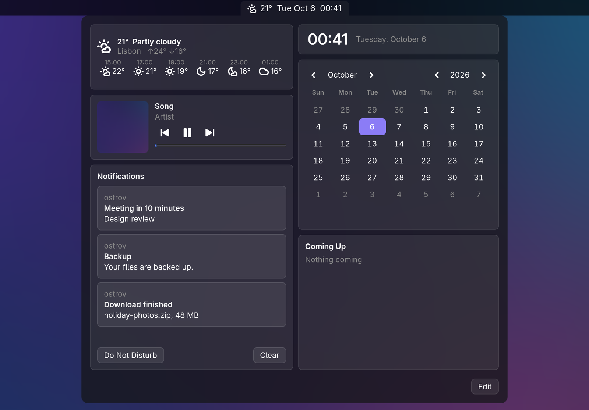

# ostrov

ostrov ("island" in Russian) is a whole desktop shell for [Hyprland](https://hyprland.org) in one Rust binary, on
GTK 4 and gtk4-layer-shell. One process replaces the usual collection of bar, notification daemon, launcher,
locker, idle daemon, polkit agent, clipboard manager, screenshot tools and wallpaper setter:

- **The bar**, made of blocks: workspaces, the focused window's title, the tray, the keyboard layout, the privacy
  indicator (mic or camera in use), the faces of the panels, and any widget on its own
  (`widget.ID`: its badge in the bar, its menu on a click).
- **Panels of widgets**, macOS-style: the control centre and the calendar are grids of widgets (Wi-Fi, Bluetooth,
  volume and mic with per-app sliders and device ports, brightness, power profiles, battery,
  displays, wallpaper, Keep Awake, the player, the month and its events (CalDAV and .ics by the plugin caldav),
  the weather, notifications' history with Do Not Disturb). Each panel is edited in place: drag, resize, remove,
  add from the gallery, choose which widgets show a badge in the bar. Make panels of your own.
- **A launcher** in the bar, dmenu-style: apps, a calculator, emoji (`:name`), files (`/name`), web search
  (`s words`, DuckDuckGo or the engine in `[launcher] search`), the clipboard's history, and plugins' modes
  (`?question` to Claude, `g words` to Google: examples/plugins).
- **Notifications** (the org.freedesktop.Notifications server) with toasts and an **OSD** for volume and
  brightness.
- **The lock screen** (ext-session-lock, PAM) and **idle** handling: lock and screens off after a while, lock before
  sleep, inhibitors honoured.
- **The polkit agent** and an **SSH askpass**, in ostrov's own dialogs.
- **The clipboard's history** (wlr-data-control), text and pictures, password managers' entries left out.
- **Screenshots** of a region or the whole screen, and **screen recording** (the official plugin `record`, over
  wf-recorder, optionally with audio).
- **The wallpaper**, and **the night light** as an official plugin (on, by the clock or from sunset to sunrise).
- **A settings UI** in the control centre, writing `config.toml` in place, and an Appearance page with themes.
- **Extensible**: widgets declared in KDL without code, plugins in any language, a D-Bus interface, and shell
  completion for every command.

<!-- Screenshots: replace with real ones before publishing. -->
<!--  -->
<!--  -->
<!--  -->

## Requirements

ostrov is made for **Hyprland 0.53** or newer. It also speaks sway's IPC for the basics (workspaces, the keyboard
layout, screens off), but the window's title and displays need Hyprland
(and so does the night light plugin).

Libraries:

- GTK 4.14 or newer
- gtk4-layer-shell 1.2 or newer (it also provides the session lock the lock screen uses)
- GLib 2.80 or newer, libwayland, PAM

Services and programs, each optional; what a missing one costs is said by `ostrov doctor`:

| What | For |
|---|---|
| PipeWire with WirePlumber: `wpctl`, `pw-dump`, `pw-cli` | volume, mic, sound devices and their ports, apps playing |
| iwd **or** NetworkManager | Wi-Fi |
| BlueZ | Bluetooth |
| UPower | the battery |
| power-profiles-daemon (`powerprofilesctl` for the games plugin) | power modes, the games' profile |
| systemd-logind | brightness, lock before sleep, `loginctl lock-session` |
| polkit with its agent helper's socket, `/run/polkit/agent-helper.socket` (recent polkit under systemd) | the polkit agent |
| `wf-recorder`, `wl-copy` (wl-clipboard); pipewire-pulse for audio | screen recording (the plugin `record`) |
| a Secret Service (GNOME Keyring, KeePassXC...) | plugins' secrets (caldav's password); without one they go to `~/.local/share/ostrov/secrets.toml` (0600) |
| `fd` | the launcher's file search |
| `/usr/share/unicode/emoji/emoji-test.txt` (unicode-data, unicode-emoji) | the launcher's emoji |

Wi-Fi: iwd is spoken to directly over D-Bus. A NetworkManager backend is being added; until it lands, `ostrov
doctor` reports NetworkManager as unsupported for Wi-Fi.

The weather and the `location CITY` lookup ask [open-meteo](https://open-meteo.com) over the network; nothing else
leaves the machine unless you configure it (a CalDAV server, .ics links, plugins with the network permission).

Building needs Rust 1.93 or newer, a C compiler, `pkg-config`, and the development files of GTK 4,
gtk4-layer-shell, GLib, libwayland and PAM:

- Arch: `pacman -S rust gtk4 gtk4-layer-shell pam pkgconf`
- Debian/Ubuntu: `apt install cargo libgtk-4-dev libgtk4-layer-shell-dev libpam0g-dev libwayland-dev pkg-config`
  (the distribution's gtk4-layer-shell must be 1.2 or newer)
- Fedora: `dnf install cargo gtk4-devel gtk4-layer-shell-devel pam-devel wayland-devel`

## Install

From source:

    git clone https://github.com/ostrov-shell/ostrov
    cd ostrov
    cargo install --locked --path .

or straight from git: `cargo install --locked --git https://github.com/ostrov-shell/ostrov`.

Packages: `packaging/arch/PKGBUILD` (ostrov-git), `cargo deb` with the `[package.metadata.deb]` section in
`Cargo.toml`, and `flake.nix` (`nix build`, `nix run`).

**The lock screen's PAM profile.** ostrov checks the password through `/etc/pam.d/ostrov` when it exists, and
through `login`'s otherwise. The packages install it; from source:

    sudo install -Dm644 packaging/pam/ostrov /etc/pam.d/ostrov

On NixOS, add `security.pam.services.ostrov = {};` instead.

## First run

Start it from `hyprland.conf`:

    exec-once = ostrov

That is all Hyprland needs. ostrov puts into the running Hyprland, over its IPC, what it relies on: the blur
behind its surfaces, `misc:allow_session_lock_restore` (a restarted ostrov takes the lock over), and its keys, each
only where the combination is free, so a bind of your own is never replaced. It does so again after every config
reload. To keep these in `hyprland.conf` instead, print them with

    ostrov hyprland

and set `rules = false` and `binds = false` under `[hyprland]` in the config. The keys:

| Key | Command |
|---|---|
| Super+D | `ostrov run`, the launcher |
| Super+X | `ostrov panel`, the control centre |
| Super+C | `ostrov calendar` |
| Super+Shift+V | `ostrov clip`, the clipboard's history |
| Print, Super+Shift+S | `ostrov screenshot` |
| Super+Shift+R | `ostrov plugin record`, the plugin `record`'s while it is on |
| Super+Shift+X | `ostrov lock` |
| Super+B | `ostrov bar toggle` |
| the XF86 volume, mic, brightness and media keys | `ostrov key ...` |

`ostrov hyprland` also suggests touchpad gestures for workspaces, which ostrov never adds itself.
A laptop's other Fn keys can be bound to `ostrov key touchpad-toggle`, `key profile` or `key camera` (the last two
only show what the firmware or a vendor service did).

Then check the system:

    ostrov doctor

It lists Hyprland and its version, which of ostrov's keys are bound and which are taken by something else, the
services on the buses, the programs ostrov runs and the PAM profile, each with what a missing one costs.

Only one ostrov runs: `ostrov ARGS` hands its arguments to the running one and prints its answer. For SSH's
askpass, point `SSH_ASKPASS` at a script that runs `exec ostrov askpass "$@"`. ostrov does not restart itself when
it dies; run it in a loop or under a supervisor if you want that (a lock survives: the next ostrov locks again at
once).

## Configuration

Everything lives under `~/.config/ostrov/`; every key has a default, so no file is needed to start.
[`config/example.toml`](config/example.toml) lists every section with its defaults:

- `[bar]`: the blocks in the bar's left, middle and right (`panel.ID`, `widget.ID` among them).
- `[idle]`: seconds to the lock and to the screens off.
- `[appearance]`, `[colors]`: the theme (dark, light, graphite, nord, solarized, or an installed one), accent,
  surface, opacity, corners, density, animations, Hyprland's blur; any palette colour overridden. Applied as the
  file is saved.
- `[hyprland]`, `[hyprland.keys]`: what ostrov puts into Hyprland, and keys moved.
- `[launcher]`: the web search's engine (`search`, {} the query; DuckDuckGo's by default).
- `[notifications]`: when toasts keep back: a game focused (`games`, window classes), quiet hours, apps let through.
- `[panels.ID]`: panels of your own.
- `[widget.ID]`, `[plugin.ID]`: a widget's or a plugin's own settings.

The panels' layouts are kept in `panel.toml`, written by Edit; display profiles in `displays.toml`. Runtime state
(the wallpaper, the location, the night light) is in `~/.local/state/ostrov/`, the clipboard's history in
`~/.cache/ostrov/`.

**The settings UI.** In the control centre, beside Edit, the gear opens Settings (a form for each section, each
widget with settings and each plugin) and the palette opens Appearance. They edit `config.toml` in place, its
comments and order kept; secrets go to the Secret Service, never to the file.

**Widgets in KDL.** A file in `~/.config/ostrov/widgets/*.kdl` declares widgets without code: commands polled or
listened to, expressions, toggles, sliders, menus, badges. See [docs/widgets.md](docs/widgets.md) and
`examples/widgets/`.

**Themes.** A directory with a `theme.toml` (colours for the palette, suggested corners, density and blur) and
an optional `theme.css`, installed into `~/.local/share/ostrov/themes/<id>/` from a path or a git URL with
`ostrov theme install`. The built-in five are the same format, under `themes/`. See [docs/themes.md](docs/themes.md)
and `examples/themes/catppuccin-mocha`.

**Plugins.** A program in any language, in `~/.local/share/ostrov/plugins/<id>/`, puts widgets, commands and
launcher modes into ostrov over JSON lines (the protocol is `wit/ostrov-plugin.wit`; SDKs for Python in
`sdk/python` and for Rust in `sdk/`, the crate `ostrov-plugin`). See [docs/plugins.md](docs/plugins.md),
`examples/plugins/hello-python`, `plugins/hello`, and the launcher modes `examples/plugins/claude` (`?question`)
and `examples/plugins/google` (`g words`). ostrov's official plugins come with it, off until `[plugin.ID] enabled =
true`: `night`, the night light (`ostrov plugin night on|off|toggle | mode off|on|time|sun | warmth K`);
`caldav`, the calendar's CalDAV account and .ics links. The same document describes ostrov's D-Bus interface, `dev.ostrov.Shell`.

## Languages

ostrov speaks English and Russian. `[appearance] language = "ru"` picks one; unset, the locale's (`LC_ALL`,
`LC_MESSAGES`, `LANG`), English for a language it has no words in. It is read at start: `ostrov restart` after
changing it.

A language is a directory of catalogues, `i18n/LANG/*.toml`, each line a text as ostrov writes it in English and
the same in that language, `{}` kept for each value:

```toml
"{} min left" = "Осталось {} мин"
```

Counts take a form by their number (`plural` in `src/i18n.rs`): a text's three forms are three keys, the second
the plural with `|few` after it, never shown in English (`"{} things missing|few" = "{} проблемы"`). A new
language is its directory and its entry in `CATALOGUES` in `src/i18n.rs`, built into the binary (and, if its
counts are not English's or Russian's, its rule in `plural`); `cargo test` checks that every catalogue reads and
keeps its `{}`. The texts of plugins and KDL widgets are theirs, shown as they give them.

## Commands

`ostrov help` prints them all, the plugins' included. Placeholders are uppercase, `[x]` is optional, `a|b` an
alternative.

ostrov's own:

    ostrov panel                       the control centre
    ostrov panel ID                    a panel
    ostrov calendar                    the calendar panel
    ostrov menu NAME                   the panel with that widget, its menu unfolded ("edit": Edit)
    ostrov settings [SECTION]          the Settings page
    ostrov appearance                  the Appearance page
    ostrov theme list                  the themes, built in and installed, the one picked starred
    ostrov theme set ID                a theme picked
    ostrov theme install PATH|GIT-URL  a theme installed from a directory or a git repository
    ostrov theme remove ID             an installed theme removed
    ostrov run                         the launcher
    ostrov clip                        the clipboard's history
    ostrov lock                        the lock screen
    ostrov awake                       Keep Awake on or off
    ostrov screenshot                  a region or the screen to the clipboard
    ostrov capture FILE                the whole screen to a PNG
    ostrov pick-region                 a region dragged out, printed as slurp does: X,Y WxH
    ostrov bar toggle|peek|unpeek      the bar docked or hidden
    ostrov key NAME                    a media or Fn key (vol-up, vol-down, vol-mute, mic-up, mic-down, mic,
                                       bright-up, bright-down, touchpad-on, touchpad-off, touchpad-toggle,
                                       profile, camera, play-pause, next, previous)
    ostrov toast TITLE [BODY...]       a notification
    ostrov dialog JSON                 a question in ostrov's look, its answer printed
    ostrov state                       what is open, and the bar's mode
    ostrov dump                        the desktop's state as JSON
    ostrov hyprland                    the hyprland.conf lines for what ostrov sets itself
    ostrov doctor                      what ostrov finds of what it works with
    ostrov welcome                     the first run's welcome again
    ostrov restart                     ostrov started again in place
    ostrov plugins                     the plugins found
    ostrov plugin [ID] [ARGS...]       a plugin's command, or its help
    ostrov completions zsh|bash|fish   the shell's completion script
    ostrov help
    ostrov askpass [--confirm|--none] PROMPT

A panel in the bar (`panel.ID`):

    ostrov panel.ID menu NAME | settings [SECTION] | appearance | size NAME W H | edit [NAME]

The modules':

    ostrov wifi on|off|scan|disconnect | connect SSID | forget SSID
    ostrov bt on|off|scan | connect|disconnect|pair|forget ADDR
    ostrov audio volume ID LEVEL | port CARD PROFILE ROUTE DEVICE
    ostrov headset                     a Bluetooth headset between headphones (A2DP) and handsfree (with its mic)
    ostrov power set PROFILE
    ostrov brightness PERCENT
    ostrov location CITY... | LAT LON
    ostrov media play-pause|next|previous
    ostrov wallpaper on|off|random | set PATH
    ostrov displays set NAME MODE POSITION SCALE | on|off NAME | mirror NAME OF | save|load|delete PROFILE
    ostrov calendar refresh

## Shell completion

The completion asks the running ostrov, so SSIDs, Bluetooth devices, monitors, widgets, settings sections and
plugins' commands complete from what it knows. The scripts are in `completions/` (the packages install them), or:

    ostrov completions zsh  > "${fpath[1]}/_ostrov"
    ostrov completions bash > ~/.local/share/bash-completion/completions/ostrov
    ostrov completions fish > ~/.config/fish/completions/ostrov.fish

## Contributing

See [CONTRIBUTING.md](CONTRIBUTING.md). Changes are listed in [CHANGELOG.md](CHANGELOG.md).

## License

MIT, see [LICENSE](LICENSE).
